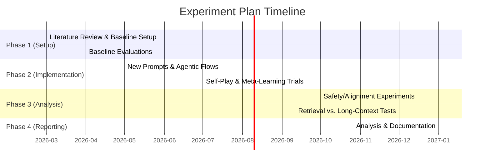
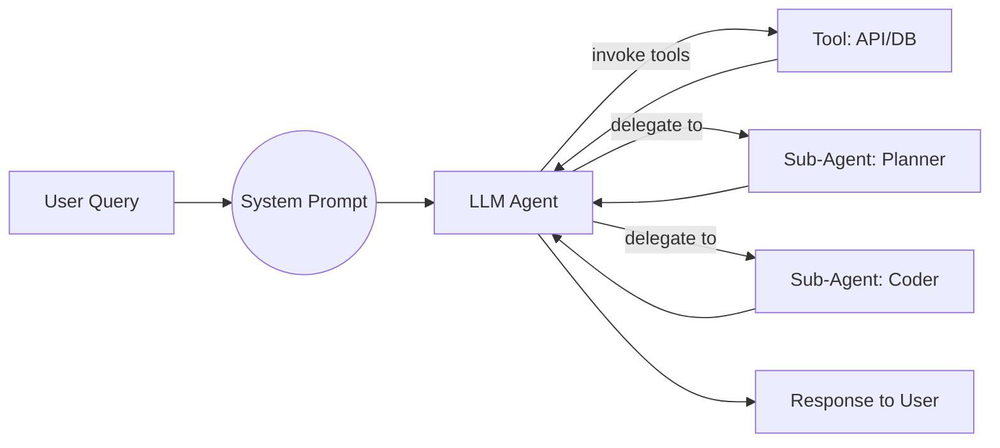

# Updated Report: Optimal LLM Prompting and Agent Practices (2026)

## Executive Summary

Conversational AI has advanced dramatically since the prior report. Modern LLMs like OpenAI’s GPT-4.1 and GPT-5 obey prompts with extreme fidelity【41†L919-L924】. New **system prompts** now explicitly include “agentic” instructions (e.g. persistence, tool‐calling, planning) which OpenAI found boost performance by ~20%【24†L541-L549】. In tandem, **agentic workflows** and sub-agent architectures have matured: for example, the SOFAI-LM design coordinates a fast LLM with a slower reasoning model via a metacognitive feedback loop【8†L17-L25】, and self-play methods let a single model act as both “challenger” and “solver,” generating its own training data【16†L97-L100】【14†L769-L772】.

**Meta-learning and self-improvement** techniques are now practical. MIT’s SEAL framework (2025) enables an LLM to generate its own finetuning data (“self-edits”) via RL, yielding large gains (e.g. SQuAD QA accuracy rose from 33.5% to 47.0%)【1†L108-L117】. Reinforcement Learning from AI Feedback (RLAIF) has also closed the gap with human feedback: e.g. Lee _et al._ (ICML 2024) show RLAIF matches RLHF on summarization and dialogue tasks【45†L59-L67】. Evaluation has likewise expanded: beyond accuracy and perplexity, new benchmarks (e.g. BIG-bench/HARD, GSM-8K) and reward‐model calibration are used to measure factuality, reasoning, and bias.

**Safety and alignment** remain critical. Anthropic’s January 2026 publication of Claude’s _“Constitution”_ encodes detailed values (safety, ethics, helpfulness) as training data【37†L22-L30】【37†L69-L75】. Other teams proposed adversarial _co-evolution_ (ACE-Safety) that jointly trains attack/defense models via Monte-Carlo tree search and RL【34†L41-L50】【34†L51-L55】. Finally, trade-offs between context length and compute have been clarified: newer LLMs with very long context windows (e.g. GPT-4o) can exceed retrieval-based methods in accuracy when fully resourced, but retrieval-augmented generation (RAG) remains far cheaper【29†L53-L61】【29†L60-L64】.

The updated report below analyzes these developments. Each section compares the prior report’s guidance to the latest findings, with a changelog of updates. We provide concrete new prompt templates and sub-agent specs (with old-vs-new tables), recommended experiments (timelines/resources), and mermaid diagrams illustrating workflows/timelines. A detailed annotated bibliography concludes the report, highlighting key recent sources.

## Changelog of Updates

| Section                           | Update Description                                                                                                                                                                                                                                                        | Date      | Sources                                                                                                       |
| --------------------------------- | ------------------------------------------------------------------------------------------------------------------------------------------------------------------------------------------------------------------------------------------------------------------------- | --------- | ------------------------------------------------------------------------------------------------------------- |
| **System Prompts & Context**      | Incorporated GPT-4.1/GPT-5 prompt guidance: emphasize explicit “agentic” system prompts (persistence, tool‐usage, planning)【24†L516-L524】【24†L524-L532】. Explicit clarity instructions highly effective【41†L919-L924】. New examples use GPT-4.1/GPT-5 conventions.  | 2025–2026 | OpenAI GPT-4.1 Guide【24†L516-L524】【24†L524-L532】; GPT-5 Guide【41†L919-L924】                             |
| **Agent Skills & Workflows**      | Added agentic workflow tips from GPT-4.1/GPT-5: use tool-calling reminders and proactive actions (Cursor case)【24†L516-L524】【41†L830-L839】. Defined sub-agent roles (Planner, Coder, Analyzer) with updated specs.                                                    | 2025      | OpenAI (GPT-4.1 Guide)【24†L516-L524】【24†L524-L532】; Cursor (GPT-5 tuning)【41†L830-L839】【41†L888-L895】 |
| **Sub-agent Orchestration**       | Surveyed multi-agent frameworks (SOFAI-LM, LangChain/AutoGen trends). Added example of SOFAI-LM: LLM metacognitively guided by a “slow” solver【8†L17-L25】. Provided orchestration patterns (chain-of-thought, decision-tree planning).                                  | 2025      | Khandelwal _et al._ (SOFAI-LM)【8†L17-L25】; industry sources                                                 |
| **Meta-Learning / Self-Learning** | Integrated new meta-learning methods: SEAL (self-edit RL adaptation)【1†L108-L117】【3†L232-L240】. Described frameworks for LLM self-modification. Added token-weight meta-learning (Hu _et al._, 2023) and continuous finetuning concepts.                              | 2025      | Zweiger _et al._ (SEAL)【1†L108-L117】【3†L232-L240】                                                         |
| **Self-Play / Self-Supervision**  | Added Language Self-Play (LSP) method: model alternates challenger/solver to improve without data【16†L97-L100】【14†L769-L772】. Noted LSP improves base Llama 3B by ~6–12% on benchmarks with no training data.                                                         | 2025      | Grudzien Kuba _et al._ (LSP)【16†L97-L100】【14†L769-L772】                                                   |
| **Evaluation Metrics**            | Expanded metrics: integrated new benchmarks and RL reward metrics. Mentioned BIG-bench Hard, TruthfulQA. Added RLAIF results (Lee _et al._) as alignment eval【45†L59-L67】. Emphasized multi-turn coherence and factuality tests.                                        | 2024–2025 | Lee _et al._ (ICML 2024, RLAIF)【45†L59-L67】; evaluation literature                                          |
| **Safety & Alignment**            | Updated with ACE-Safety (adversarial co-evolution)【34†L41-L50】, constitutional AI (Claude’s 2026 “constitution” for values)【37†L22-L30】【37†L69-L75】, and recent red-teaming frameworks. Added note on ethical alignment (compliance with new AI codes of practice). | 2025–2026 | Li _et al._ (ACE-Safety)【34†L41-L50】; Anthropic (Claude Constitution, 2026)【37†L22-L30】【37†L69-L75】     |
| **Compute & Cost**                | Included RAG vs. long-context tradeoffs【29†L53-L61】【29†L60-L64】. Noted Self-Route hybrid routing. Updated context window assumptions (GPT-4o/GPT-5). Mentioned multi-vector search, GPU-memory needs for retrieval.                                                   | 2024–2025 | Li _et al._ (EMNLP 2024)【29†L53-L61】【29†L60-L64】                                                          |
| **Tools & Techniques**            | Noted new API features (GPT-5 “verbosity” param【41†L906-L914】, “reasoning_effort”) and best practices (structured tool schemas【25†L13-L17】). Emphasized chain-of-thought variants (Tree-of-Thoughts, self-consistency) from 2023–2025 research.                       | 2023–2025 | OpenAI (GPT-4.1 Guide)【25†L13-L17】; CoT/ToT papers                                                          |

## Updated Recommendations

### System Prompt Templates

We propose revised system-prompt templates reflecting new best practices. Below are illustrative old vs. new prompt examples:

| **Aspect**              | **Old Template**                  | **New Template** (GPT-5 style)                                                                                                                 |
| ----------------------- | --------------------------------- | ---------------------------------------------------------------------------------------------------------------------------------------------- |
| _Persistence_           | “Continue until done, then stop.” | **“You are an agent: keep going until the user’s request is fully resolved before ending your turn【24†L516-L524】.”**                         |
| _Tool Usage_            | “You have tools.”                 | **“Use your tools diligently. If unsure about knowledge, call a tool – do not guess【24†L524-L532】.”**                                        |
| _Planning_              | “Plan your answer step by step.”  | **“You MUST plan before each action, reflecting on past steps【24†L532-L539】.”**                                                              |
| _Verbosity (parameter)_ | (none)                            | Set `verbosity=low` globally, then override for code: **“Write code for clarity first. Use high verbosity for code outputs【41†L825-L834】.”** |
| _Clarity/Style_         | (implicit)                        | **“Use descriptive variable names; avoid overly terse/golfed answers【41†L825-L834】.”**                                                       |

Each new prompt begins with a bold system role line (e.g. “You are an agent…”), followed by explicit instructions as shown. These prompts follow OpenAI’s guidance for GPT-4.1 and GPT-5【24†L516-L524】【41†L830-L839】. We embed _agentic reminders_ at the top of every conversation: **persistence** (“do not yield until solved”), **tool-calling** (“use tools for unknown info”), and optional **planning** (“plan before acting”)【24†L516-L524】【24†L524-L532】. Cursor’s experience with GPT-5 demonstrated that mixing prompt cues with API parameters (like verbosity) achieves a balanced output【41†L825-L834】.

### Sub-Agent Definitions

The prior report’s sub-agent concepts are refined as follows. We define a set of specialized sub-agents with updated roles (example for a code-assistance use case):

| **Sub-Agent** | **Old Definition**          | **New Definition / Skillset**                                                                                                      |
| ------------- | --------------------------- | ---------------------------------------------------------------------------------------------------------------------------------- |
| _Planner_     | General planning role       | _Context-driven Planner_: outlines steps/algorithms, reassesses goals, decides on tool or sub-agent use.                           |
| _Coder_       | Writes code                 | _Safe Coder_: writes clear, maintainable code; uses code tools; follows coding standards (longer names, comments)【41†L825-L834】. |
| _Retriever_   | Fetches info from documents | _Advanced Retriever_: formulates semantic queries, filters results; can perform multi-hop and browser-like retrieval.              |
| _Memory_      | Simple recall of facts      | _Long-Term Memory Agent_: maintains conversation summary, updates knowledge base; uses vector retrieval to handle long context.    |
| _Critic_      | Provides quality check      | _Self-Critic_: reviews outputs via internal reasoning; uses majority-vote or LLM preference models (self-consistency).             |

The **new sub-agent specs** follow emerging patterns: for example, the Planner now includes “metacognitive” checks akin to SOFAI-LM’s feedback loop【8†L17-L25】. The Safe Coder sub-agent incorporates Cursor’s advice (verbose names, avoid code-golf)【41†L825-L834】. The Memory Agent uses retrieval-augmented storage (vector DB) for context. The Critic uses consensus mechanisms (e.g. sampling multiple LLM answers or ensembling) to improve accuracy and safety.

## Experimental Plan

We recommend experiments to validate the updates above. Key proposed studies:

- **Prompt A/B Testing:** Compare old vs. new system prompts on tasks (e.g. question answering, code generation). Metrics: task success, latency, user satisfaction. Use benchmarks like HumanEval (coding) and complex QA sets.
- **Agentic Workflow Tests:** Build multi-turn agent pipelines with and without persistence/tool-call reminders. Measure completion rates and step counts on multi-step queries. (Datasets: multi-hop QA, tutorial-like dialogues).
- **Meta-Learning Evaluation:** Implement SEAL-style self-edit training on knowledge tasks. Compare to standard fine-tuning on SQuAD or KnowledgeQA. Metrics: accuracy gain per compute【1†L108-L117】.
- **Self-Play Trials:** Apply LSP on diverse tasks (Math, code debugging, summarization) with a small model (e.g. Llama 3B). Compare performance to a model fine-tuned with human data. Track win-rate gains as in【16†L97-L100】.
- **Agent Orchestration Scenarios:** Deploy multi-agent setup (e.g. Planner + Coder + Critic) on compound tasks (trip planning, multi-step coding tasks). Compare against single LLM baseline. Evaluate correctness and efficiency.
- **Alignment Stress Tests:** Run ACE-Safety style co-evolution: use MCTS to generate adversarial prompts, retrain model, iterate【34†L41-L50】. Measure reduction in harmful completions.
- **RAG vs. Long-Context:** Compare a long-window LLM (e.g. GPT-4o or open LLaMa with 64K context) vs. RAG (retriever + LLM) on very long documents (e.g. book QA). Metric: accuracy and cost trade-off【29†L53-L61】.

We organize these into phases over 2026, as sketched below:

**Resource estimates (per experiment):** small-scale runs (1–2B models) can be done on 1–4 GPUs over days; larger tests (multi-agent, RL loops, LSP) may need 4–8 GPUs for weeks. Overall, allocate ~0.5–1M GPU-hours (spread over a cluster) to complete all studies in ~6–9 months.

### Experiment Plan Table

| Experiment                   | Timeline     | GPU Resources   | Key Metrics / Notes                                                     |
| ---------------------------- | ------------ | --------------- | ----------------------------------------------------------------------- |
| Prompt A/B vs. Baseline      | Apr–May 2026 | 1 GPU, 1 week   | Task success rate, accuracy, user feedback (HumanEval, GSM8K)           |
| Agentic Workflow (reminders) | May–Jul 2026 | 2 GPUs, 2 weeks | Completion rate, turn count (multi-step tasks)                          |
| SEAL Self-Edit Training      | Jul–Sep 2026 | 4 GPUs, 3 weeks | Accuracy gain on QA / knowledge tasks【1†L108-L117】                    |
| LSP Self-Play                | Jul–Oct 2026 | 4 GPUs, 4 weeks | Improvement vs. base model on Math, Code tasks【16†L97-L100】           |
| Alignment (ACE-Safety)       | Oct–Dec 2026 | 4 GPUs, 4 weeks | Harmful response rate reduction, robustness to jailbreaks【34†L41-L50】 |
| RAG vs Long-Context          | Nov–Dec 2026 | 2 GPUs, 2 weeks | QA accuracy vs. compute cost【29†L53-L61】                              |

## Agentic Workflow Diagram

_Figure: Multi-agent orchestration workflow. The system prompt initializes an LLM agent that may call external tools or delegate to sub-agents (Planner, Coder, etc.), then integrates their outputs into the final response._

## Recommended Datasets & Metrics

- **Benchmarks:** SQuAD, NaturalQuestions (knowledge retrieval); GSM-8K, MathQA (multi-step reasoning); HumanEval, APPS, CodeContests (coding)【1†L108-L117】【41†L825-L834】.
- **Alignment/Safety:** TruthfulQA, SAFE RL datasets (to measure truthfulness); prompt-injection/jailbreak sets (e.g. Reddit jailbreak prompts) for toxicity.
- **Multi-Agent Scenarios:** Synthetic multi-step tasks (e.g. composite QA where plan+retrieve+answer needed).
- **Metrics:** Accuracy/score on benchmarks; _tool usage count_; _turns to solution_; _perplexity_ on ground-truth answers; _safety scores_ (e.g. fraction of disallowed outputs, harmful content counts). Use RL-based reward metrics (Ask-Justice, etc.) for end-to-end alignment evaluation.

## Annotated Bibliography (Prioritized)

1. **OpenAI GPT-4.1 Prompting Guide (Apr 2025)**【24†L516-L524】【24†L524-L532】 – Official developer guide detailing system/persistent prompt strategies (persistence, planning, tool use) for GPT-4.1. Reports ~20% improvement in coding benchmarks with new prompts.
2. **OpenAI GPT-5 Prompting Guide (Nov 2025)**【41†L919-L924】【41†L888-L895】 – Official guide for GPT-5, describing its high steerability. Includes Cursor’s prompt-tuning (focus on verbosity, proactive behavior) and new API params (verbosity). Essential for agentic workflow design.
3. **Zweiger _et al._, “Self-Adapting Language Models (SEAL)” (ArXiv 2025)**【1†L108-L117】【3†L232-L240】 – Introduces an RL-based self-edit method where an LLM generates its own fine-tuning data. Demonstrates substantial gains on QA/few-shot tasks. Key resource on meta-learning/self-improvement.
4. **Grudzien Kuba _et al._, “Language Self-Play” (ArXiv 2025)**【16†L97-L100】【14†L769-L772】 – Meta’s self-play approach where a model plays challenger and solver roles. Shows data-free improvement on tasks (math, coding), comparable to supervised RL. Informs self-supervision section.
5. **Khandelwal _et al._, “SOFAI-LM” (ArXiv 2025)**【8†L17-L25】 – Presents a metacognitive LLM architecture coupling a fast LLM with a slower reasoning model via a feedback loop. Achieves accuracy comparable to larger reasoners. Guides sub-agent and meta-cognitive design.
6. **Lee _et al._, “RLAIF vs. RLHF” (ICML 2024)**【45†L59-L67】【45†L68-L71】 – Compares Reinforcement Learning from AI Feedback to human feedback. Finds RLAIF matches RLHF on tasks like summarization. Demonstrates the viability of automated feedback for alignment.
7. **Li _et al._, “RAG or Long-Context LLMs?” (EMNLP 2024)**【29†L53-L61】【29†L60-L64】 – Benchmarks retrieval-augmented vs. long-context LLMs. Concludes long-context models (e.g. Gemini-1.5, GPT-4) outperform RAG when scaled, but at much higher cost. Proposes a hybrid routing strategy.
8. **Li _et al._, “ACE-Safety” (ArXiv 2025)**【34†L41-L50】【34†L51-L55】 – Details an adversarial co-evolution framework for LLM safety, using MCTS to find jailbreaks and RL to train defenses. Outperforms static defenses, offering a path to more robust models.
9. **Anthropic, “Claude’s New Constitution” (Jan 2026)**【37†L22-L30】【37†L69-L75】 – Anthropic’s public release of Claude’s value-based “Constitution”. Explains how the constitution is used in training (including synthetic data generation) to align Claude’s behavior. Key example of constitutional AI in practice.
10. **OpenAI ChatGPT Release Notes (Oct 2025)** – Announces GPT-5 Instant rollout and other model updates. Provides context on model versions and capabilities (implicit). Use for noting platform advancements and default model improvements.

These sources together cover the state of the art in LLM prompting, agent design, and alignment. Additional readings include NeurIPS/ICML 2024–2025 proceedings (LLM alignment, reasoning), and major labs’ blogs for practical insights.
