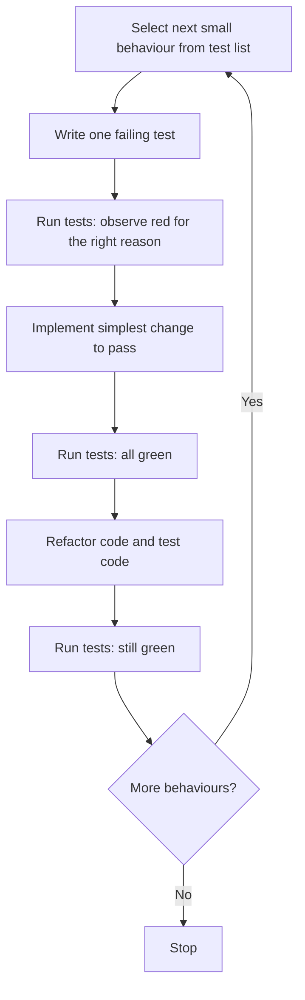
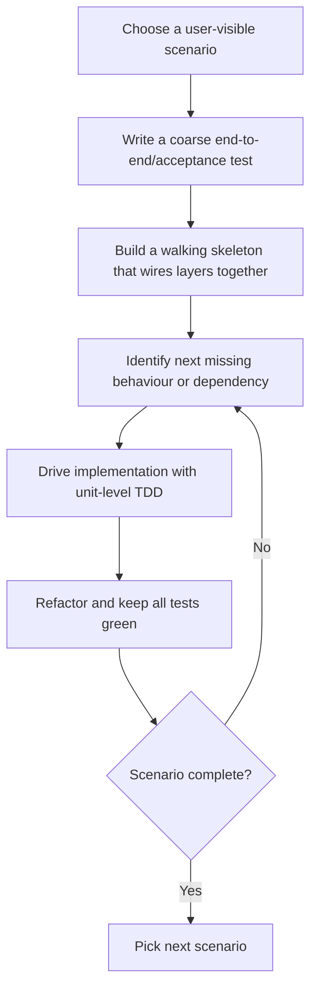
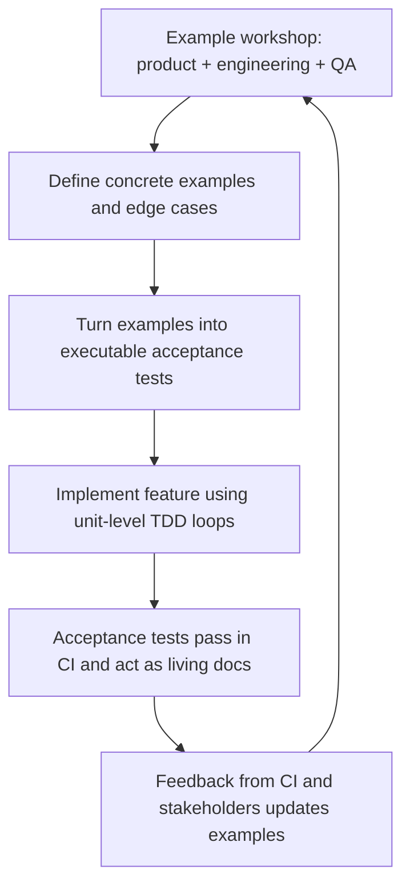

# Test-Driven Development Best Practices

## Executive summary

Test-Driven Development (TDD) is a disciplined micro-loop in which you specify a small slice of behaviour as an automated test, observe it fail, implement the simplest change that makes it pass, then refactor while keeping the whole suite green. The canonical description emphasises keeping a running “test list”, turning exactly one item into a runnable test, making that test (and all previous tests) pass, and refactoring optionally but frequently. citeturn2search0turn0search0turn17view0

Across workflow variants (classic Red-Green-Refactor, outside-in/“walking skeleton”, London/mockist, and acceptance-test-driven development), the consistent best-practice theme is to optimise for rapid, trustworthy feedback: small tests that are easy to interpret when they fail; a fast unit-test layer; and careful management of nondeterminism (time, concurrency, network, shared state) to prevent flaky tests. citeturn10search1turn10search5turn9search22turn22view1turn10search7

Empirical evidence is mixed but not random: meta-analyses and systematic reviews generally report small improvements in external quality/defects and inconsistent effects on productivity; industrial case studies sometimes show large defect reductions but also report increased initial development time; controlled experiments in academic or “semi-industrial” settings often find small or no differences versus iterative test-last comparators. The net effect depends strongly on context (developer experience, task type, how “test-last” is operationalised, organisational constraints, and adherence to the intended TDD cycle). citeturn17view0turn15view2turn0search1turn19view0turn25search0

For teams, the high-leverage recommendations are: treat test reliability as a first-class quality attribute; avoid turning coverage into a target; use mutation testing selectively to assess whether tests would actually detect faults; and build automation that keeps the feedback loop short (local runs, pre-commit, CI, and fast PR gating). citeturn20view1turn8search5turn3search7turn7search2turn7search1

## Core principles and rationale

### What TDD is, in precise operational terms

TDD is not “write tests before code” as a one-off phase. It is an iterative development style where tests are added incrementally before (or at least in front of) production changes, with frequent execution of the suite, and refactoring interleaved with implementation. The red/green/refactor cycle is widely used shorthand, but canonical process descriptions explicitly include a prior step of building and maintaining a list of test scenarios and then driving the code one scenario at a time. citeturn0search0turn2search0turn17view0

A useful way to be rigorous about “doing TDD” is to check conformance: are you routinely (a) writing a test that would fail for the right reason, (b) implementing only enough change to make it pass, and (c) refactoring in small behaviour-preserving steps with tests as the regression safety net. This conformance focus matters because many critiques of TDD target practices that drift into “test-after with extra steps” or “mock-heavy scripting” rather than the micro-loop intended by TDD’s originators. citeturn2search0turn0search0turn11search3

### Why experienced teams use it

The strongest rationale for TDD is the quality of feedback it creates. By forcing you to articulate the client-facing behaviour first, you are pushed to clarify requirements and APIs before committing to internal structure, and you get a continuously executable regression suite that supports refactoring. citeturn0search0turn9search2turn9search22

TDD can also function as an explicit design pressure: if a behaviour is hard to test, it often signals accidental complexity or mixed responsibilities that can be improved by separation of concerns, dependency inversion, and test seams. This is why TDD is often discussed together with evolutionary design (design that evolves through refactoring under test protection rather than being fully specified up front). citeturn0search0turn9search0turn9search1

### What TDD is not, and the boundaries of the claim

TDD is not a guarantee of good tests or good design. It is entirely possible to accumulate a large suite that is brittle, slow, and over-coupled to implementation details, therefore inhibiting refactoring (the opposite of the intended effect). Guidance from the testing literature stresses behaviour-oriented assertions and avoiding reflection of internal code structure in unit tests, specifically to prevent refactor-hostile suites. citeturn9search22turn1search0turn10search1

TDD is also not synonymous with “only unit tests”. Mature workflows typically mix unit tests with broader tests (integration, end-to-end, acceptance), and many TDD variants explicitly start with a coarse integration or acceptance scenario (“outside-in”) before drilling down into units. citeturn24search8turn1search2turn10search7

## Workflows and variants

### Classic Red-Green-Refactor

The “classic” workflow is a tight loop with a deliberately small scope per iteration: pick one behaviour from a test list; write a runnable test that fails; make it pass with the simplest implementation; refactor in small, behaviour-preserving steps; repeat. citeturn2search0turn0search0turn17view0



citeturn2search0turn0search0turn17view0

Practical variation inside the classic loop: some teams explicitly timebox “green” to prevent premature over-design, then rely on refactoring once green to recover good structure. This is consistent with the idea that refactoring is a controlled technique of small behaviour-preserving transformations rather than a rewrite phase. citeturn9search2turn0search0turn17view0

### Classicist and London styles

The most important strategic fork is not “test-first vs test-last” but how you use test doubles.

In the classicist style, you generally prefer real collaborators (or lightweight fakes) and state-based assertions, using mocks mainly at integration boundaries (network, databases, non-deterministic services) where realism is expensive or flaky. This tends to produce tests that are less coupled to internal call structure, but sometimes requires more setup and can yield slower tests if collaborators are not kept lightweight. citeturn1search0turn9search22turn22view1

In the London/mockist style, you isolate the unit under test by mocking collaborators and asserting interactions (calls, order, parameters). This can drive a message-oriented design and make dependencies explicit early, but it increases the risk that tests encode implementation details and become brittle under refactoring—especially if you mock “your own code” rather than true external dependencies. citeturn1search0turn11search3turn9search22

A reliable hybrid approach is to default to classicist tests for domain logic and use mocks selectively at seams where nondeterminism or cost makes real collaborators unsuitable, while using “verifying doubles” or strict mocks to reduce interface drift when mocks are used. citeturn1search0turn5search3turn9search1

### Outside-in TDD and walking skeletons

Outside-in TDD starts from a user-visible scenario and progresses inward through layers. In practice, it often begins by building a coarse integration (“walking skeleton”) that exercises real wiring end-to-end, then refining internals with unit-level TDD loops. This approach intentionally frontloads integration risks (deployment, configuration, wiring, contracts) rather than discovering them late. citeturn24search8turn10search7turn11search6



citeturn24search8turn10search7turn0search0

Trade-off: outside-in can produce better system-level alignment and earlier integration confidence, but the “coarse test” layer is inherently costlier and more prone to nondeterminism unless you make it hermetic (self-contained dependencies, stable environments, controlled time). citeturn10search7turn22view1turn10search16

### Acceptance test–driven development and specification by example

Acceptance Test–Driven Development (ATDD) (often discussed as specification by example) is a collaborative requirements discovery approach where examples become automatable acceptance tests, acting as executable specifications and living documentation. citeturn1search2turn1search13turn12search8

A common implementation uses Gherkin feature files (Given/When/Then) and a runner such as Cucumber; the acceptance tests drive feature completion, and developers use unit-level TDD inside each acceptance scenario to design and implement components. citeturn12search2turn27search1turn1search13



citeturn1search2turn12search2turn1search13turn10search1

Critical detail: ATDD is at its best when acceptance criteria remain behaviour-focused and stable, while the internal unit-test layer remains refactor-friendly. If acceptance tests encode UI mechanics or brittle timing assumptions, they become a major source of flakiness and slow feedback. citeturn10search7turn22view1turn11search6

## Test design best practices

### Naming, intent, and making failures actionable

For experienced teams, test names and failure messages are operational tooling: they are often the first (and sometimes only) information available in CI failures. Guidance from large-scale engineering practice is to name tests after the behaviour being tested (not just the method name) and to ensure failures are actionable from the test name and message alone. citeturn10search5turn10search1

A practical naming template that scales:
- “should <expected behaviour> when <condition>”
- “<unit>_<state/condition>_<expected behaviour>” (common in many codebases)

The key constraint is: names should encode the scenario and expectation with enough precision that someone can triage the failure without re-running. citeturn10search5turn10search1

### Granularity and structure of a good unit test

The Arrange–Act–Assert (AAA) pattern is widely recommended to separate setup from action and verification, reducing accidental complexity inside the test and making failures easier to interpret. citeturn10search9

Granularity heuristics that hold up in practice:
- Prefer one behavioural claim per test (or per parameterised test case), so failures identify a single broken rule. citeturn10search1turn10search9
- Prefer parameterised tests for input/output tables; it reduces duplication while keeping the behaviour surface clear (pytest parametrisation; NUnit `TestCase`; JUnit parameterised tests). citeturn4search11turn4search17turn4search0
- Avoid asserting irrelevant details (internal call order, exact intermediate representations) unless behaviour requires it; otherwise you manufacture brittleness. citeturn9search22turn1search0

### Isolation, fixtures, and test data management

Test fixtures exist to create a stable baseline so tests are repeatable; frameworks like pytest explicitly frame fixtures as a way to ensure reliable, consistent results. citeturn4search19

Best practices that reduce coupling and flakiness:
- Prefer “fresh fixture per test” for mutable state, so tests do not depend on execution order. Fixture setup patterns emphasise intent-revealing setup helpers and avoiding shared mutable fixtures that leak state. citeturn10search3turn22view1
- Be explicit about fixture scope (per-test vs per-class vs session) because wider scopes trade speed for shared-state risk. citeturn4search15turn4search1
- Encapsulate test object construction behind builders/factories in test code, so adding fields or invariants does not force hundreds of tests to change. This is a core theme of fixture refactoring patterns in xUnit literature. citeturn10search3turn10search19

### Assertions and what to assert

A robust rule: assert observable behaviour, not internal structure. The practical test pyramid guidance explicitly warns that unit tests which mirror internal code structure become painful when refactoring because they break even when behaviour is unchanged. citeturn9search22

When assertions fail, the output should be diagnostic. This includes clear expected/actual values, helpful labels, and (where available) richer matchers that produce readable diffs. The goal is to avoid “re-run with logging” as the default debugging flow. citeturn10search1turn10search9

### Using mocks and test doubles without damaging design

The most durable framing is: test doubles exist to control cost and nondeterminism or to isolate a unit’s contract at a seam. They are not inherently good; overuse can force unnatural decomposition or produce tautological tests that merely restate mock expectations. citeturn1search0turn11search3turn9search1

Concrete practices:
- Prefer fakes over mocks for stable collaborators (in-memory repository, fake clock, fake mailer), because fakes tend to preserve behavioural semantics and reduce interaction-coupling. citeturn1search0turn9search22
- If you do use mocks, prefer verifying/strict forms when available to reduce interface drift (RSpec verifying doubles enforce real-method presence; similar “spec” patterns exist in other ecosystems). citeturn5search3turn5search17
- Avoid mocking “your own code” across layers. Instead, carve a seam and test the composed behaviour at a higher level (classicist default), or accept that you are deliberately choosing interaction-based constraints and expect more refactoring friction. citeturn11search3turn9search22turn1search0

### Flakiness avoidance and making tests deterministic

Flaky tests undermine regression testing because outcomes become non-deterministic; large empirical studies classify root causes such as async waits, concurrency, and test order dependency, with fixes often involving explicit synchronisation and cleaning shared state. citeturn22view0turn22view1turn22view2

Practices that consistently reduce flakiness:
- Eliminate hidden shared state between tests; many order-dependent flaky tests are fixed by setup/cleanup that restores state before/after each test. citeturn22view2turn4search1
- Control time and timers. JavaScript ecosystems provide explicit fake timer support and emphasise restoring real timers to prevent leakage between tests. citeturn5search0turn5search4turn5search1
- Control randomness by fixing seeds and testing boundary values; this is explicitly recommended in flaky-test remediation guidance. citeturn22view2
- Treat multi-threaded mocks as a flakiness hazard: mocking frameworks explicitly warn that stubbing/verifying shared mocks across threads tends to produce intermittent behaviour. citeturn6search20turn22view1
- Keep the largest tests hermetic wherever possible, because non-hermetic large tests are difficult to make deterministic. citeturn10search7turn10search16

## Design and refactoring strategies

### Emergent design under test protection

TDD’s design benefit is not magic; it is a pressure system. If you repeatedly implement the smallest behaviour and then refactor, you tend to converge on smaller units with clearer responsibilities and more explicit dependencies because these shapes are easier to test and easier to change. citeturn0search0turn9search22turn9search2

However, there is a known failure mode: designing primarily for ease of unit testing can lead to “test-induced design damage” when isolation becomes the goal rather than coherent design. A practical safeguard is to allow coupling where it improves coherence, and to validate architecture with integration slices (walking skeletons) so you do not over-abstract prematurely. citeturn11search18turn24search8turn11search6

### SOLID, dependency inversion, and dependency injection

TDD frequently pushes teams toward the dependency inversion and interface segregation aspects of SOLID because hard-coded dependencies (time, filesystem, databases, random, network) are expensive to test and create nondeterminism. SOLID is explicitly positioned as a set of principles intended to improve understandability and maintainability, and it is widely linked to agile methods. citeturn9search3turn9search0

Dependency injection (DI) is a common mechanism for expressing these dependencies explicitly; classic DI discussions contrast injection with service locator approaches and explain how injection changes wiring and testability. citeturn9search0

A pragmatic rule that keeps designs grounded: inject unstable or expensive concerns (time, randomness, IO, network clients) but avoid injecting everything “just in case”. If you can test the behaviour with a simple fake or an in-memory implementation, that is often better than introducing an abstraction layer solely for mocking. citeturn1search0turn22view1turn11search3

### Interfaces, seams, and working with legacy code

A seam is a place where you can alter behaviour without editing the source in that place; in modern practice, seams are used to break dependencies so you can add probes, improve observability, and simplify testing during modernisation. citeturn9search1turn9search21

TDD in legacy contexts often becomes “characterisation testing + seam creation + refactor” rather than pure red/green/refactor. The key is to create safe points of intervention (seams) before attempting deep refactors. citeturn9search1turn9search2

### Refactoring strategies and when to refactor

Refactoring is defined as a controlled technique of small behaviour-preserving transformations that cumulatively improve design while reducing risk through small steps. citeturn9search2

In TDD, refactoring is not a separate phase at the end of the project; it is the third step in the micro-loop. The practical question is not “should we refactor?” but “what do we refactor now that the behaviour is protected?” citeturn0search0turn17view0turn9search2

High-value refactoring targets that TDD naturally exposes:
- Duplication and unclear naming in both production and test code (because duplication makes tests harder to evolve). citeturn9search2turn10search3  
- Over-coupled units where tests are brittle under minor design changes (a signal you are testing internals). citeturn9search22turn1search0  
- Hidden dependencies (time, global state, random, environment variables) that cause flakiness; refactor to make them injectable or controllable. citeturn22view2turn5search0turn4search3  

An operational gate: refactor immediately after “green” when the change is fresh and still small. Large refactors without stabilising tests first increase risk and frequently regress into manual testing. citeturn9search2turn9search1

## Tooling, automation, and metrics

### Frameworks, mocks, coverage, CI, mutation testing

TDD is easiest when tooling makes the feedback loop cheap.

For unit tests and fixtures:
- Java commonly uses JUnit; the current JUnit 5 user guide documents parameterised tests and display-name controls, which are useful for readable failure output. citeturn4search0  
- C# commonly uses xUnit/NUnit/MSTest; Microsoft’s guidance documents test structure (AAA) and setup patterns, and MSTest is positioned as a fully supported, cross-platform test framework. citeturn10search9turn26search2turn4search1  
- Python commonly uses pytest; the docs cover fixtures, parametrisation, and facilities like `monkeypatch` for controlled replacement of environment dependencies. citeturn4search19turn4search11turn4search3  
- JS/TS commonly uses Jest or Vitest; both document fake timers, module mocking, and restoring to real timers to avoid cross-test contamination. citeturn5search0turn5search1turn5search4  
- Ruby commonly uses RSpec; RSpec’s verifying doubles are explicitly recommended over normal doubles to maintain interface fidelity. citeturn5search3turn5search17  

For mocking/stubbing:
- Python standard library documents `unittest.mock` and `patch()` semantics; mocking correctness often depends on patching “where used”. citeturn5search2turn5search20  
- Java mocking is commonly done with Mockito; its documentation describes creation, stubbing, and verification. citeturn6search0  
- .NET mocking is commonly done with Moq; the Quickstart shows `Setup`/`Returns` patterns and related features. citeturn28view0  
- JavaScript ecosystem offers Sinon for spies/stubs/mocks, designed to work with any test framework. citeturn6search1turn6search22  

For coverage:
- Java: JaCoCo documents code coverage concepts and is commonly integrated into builds (e.g., via Gradle’s JaCoCo plugin). citeturn7search0turn7search16  
- .NET: Microsoft documents using Coverlet and report generation. citeturn7search1  
- Python: coverage.py documents how it tracks executed code and reports missed code. citeturn7search2  
- JS/TS: Istanbul explains instrumentation and coverage reporting; `nyc` is the CLI commonly used for integration. citeturn7search3turn7search7  
- Ruby: SimpleCov documents coverage collection and reporting behaviour. citeturn6search2  

For mutation testing:
- The core mechanism is “introduce small changes (mutants) and run tests; survivors indicate inadequate tests.” This is the definition used by Stryker’s documentation and echoed in mutation-testing tooling docs. citeturn8search5turn3search7turn8search9  
- Java: PIT documents mutation operators and concepts and is positioned as a practical mutation system for JVM projects. citeturn3search3turn3search7  
- .NET: Microsoft’s mutation testing guidance describes Stryker.NET integration. citeturn8search9turn8search1  
- JS/TS: Stryker documentation covers configuration and mutant coverage optimisation. citeturn8search0turn8search5  
- Python: mutmut documents mutation testing workflows and incremental operation. citeturn8search3  
- Ruby: Mutant documents mutation testing as “semantic coverage” verification. citeturn8search6turn8search2  
- Mutation testing has a long research history; review literature describes its evolution and framing as error-based testing. citeturn1search3turn1search18  

### Metrics and quality indicators that actually help

Test metrics are only useful if you treat them as signals, not targets.

Coverage:
- Coverage can identify untested areas, but empirical studies show that once you control for test suite size, coverage correlates only low-to-moderately with fault detection effectiveness; it is therefore unsafe to treat coverage as a direct proxy for test effectiveness or as a quality target. citeturn20view1turn2search3
- Practical implication: use coverage to ask “what did we miss?”, not “did we hit 90%?”. citeturn20view1turn7search2

Mutation score:
- Mutation score (killed vs survived mutants) better approximates whether tests detect behavioural faults, but it is computationally expensive and subject to equivalent mutants; tooling docs therefore emphasise configuration and performance optimisation (e.g., running only tests that cover a mutant). citeturn8search0turn8search5turn3search7

Execution time:
- Fast unit tests preserve the TDD feedback loop; larger tests are valuable but can be nondeterministic and slower, and non-hermetic large tests are especially difficult to keep deterministic. citeturn10search7turn10search16turn11search6

Flaky rate:
- Flaky tests directly reduce trust in CI; research highlights dominant categories (async wait, concurrency, order dependency) and shows that fixes often involve synchronisation and cleaning shared state. citeturn22view1turn22view2

### Comparison table of recommended practices and trade-offs

| Decision point | Recommendation | Upside | Trade-offs / risks | When it fits best | Key references |
|---|---|---|---|---|---|
| Naming | Name tests by behaviour; ensure failures are actionable from name + message | Faster triage; less re-run/debug churn | Requires discipline; longer names | CI-heavy teams; large suites | citeturn10search1turn10search5 |
| Assertions | Prefer observable-behaviour assertions over internal structure | Refactor-friendly tests | May need higher-level tests for certain invariants | Domains with frequent refactors | citeturn9search22turn1search0 |
| Fixtures | Default to fresh per-test fixtures; minimise shared mutable state | Reduces order dependency and flakiness | More setup cost per test | Large teams; parallel execution | citeturn10search3turn22view2turn4search19 |
| Mocking internal collaborators | Use fakes by default; mock sparingly and verify doubles where possible | Less interaction-coupling; better semantics | Fakes can drift if not maintained | Domain logic, in-memory repos | citeturn1search0turn5search3 |
| Boundaries | Mock or stub expensive/nondeterministic boundaries (network, clock, randomness) | Speed and determinism | Risk of incorrect modelling; missing integration issues | Unit layer; stable contracts | citeturn22view2turn9search1turn5search0 |
| Workflow variant | Use outside-in (walking skeleton) when integration risk is high | Early integration confidence | Coarse tests slower/flakier if not hermetic | New services; complex wiring | citeturn24search8turn10search7turn22view1 |
| Acceptance layer | Use ATDD/specification by example for shared understanding | Aligns stakeholders; living documentation | Can become brittle UI scripting | Product teams with ambiguity | citeturn1search2turn12search2turn1search13 |
| Coverage gating | Treat coverage as gap-finding, not a KPI | Avoids gaming; focuses on risk | Requires judgement | Most codebases | citeturn20view1turn2search3 |
| Mutation testing | Use mutation testing periodically for critical modules | Detects weak tests beyond coverage | Slow; equivalent mutants; tuning needed | Security-critical, core logic | citeturn8search5turn3search7turn8search9 |
| Flakiness management | Track flaky rate; fix root causes rather than retrying | Restores trust in CI | Root-cause fixes may require redesign | Any CI-driven org | citeturn22view1turn10search16turn11search6 |

### Language and ecosystem notes

No specific language or framework constraints were supplied, so the notes below reflect common, currently documented choices and a few ecosystem pitfalls relevant to TDD.

Java:
- JUnit 5 provides parameterised tests and display-name configuration useful for readable test reports. citeturn4search0  
- Mutation testing for JVM projects is commonly done with PIT; its docs describe bytecode-level mutation operators and integration with typical build tooling. citeturn3search3turn3search7  
- Coverage commonly uses JaCoCo; official docs cover counters and integration paths. citeturn7search0turn7search12  

C#:
- Microsoft’s testing guidance discusses AAA and unit test best practices, and Microsoft documents coverage workflows using Coverlet. citeturn10search9turn7search1  
- MSTest is documented as a fully supported cross-platform framework; NUnit documents `SetUp`/`TearDown` lifecycle attributes; xUnit documents shared context patterns. citeturn26search2turn4search1turn4search18  
- Moq’s Quickstart documents the core `Setup`/`Returns`/verification patterns. citeturn28view0  
- For BDD/ATDD, note that SpecFlow is marked end-of-life after 2024-12-31, and Reqnroll positions itself as a reboot of SpecFlow. citeturn27search9turn27search11  

JavaScript/TypeScript:
- Jest documents fake timers and mock functions, including enabling and later restoring timers to prevent leakage across tests; Vitest documents similar timer mocking and date control. citeturn5search0turn5search4turn5search1turn5search12  
- Istanbul documents instrumentation-based coverage and `nyc` integration patterns, which are common in CI pipelines. citeturn7search3turn7search7  
- Mutation testing is commonly done with StrykerJS; its docs explain mutation scoring and optimisations like running only tests that cover a given mutant. citeturn8search0turn8search5  

Python:
- pytest docs emphasise fixtures as a mechanism for consistent, repeatable baselines and provide `monkeypatch` for safely altering globals/env in tests. citeturn4search19turn4search3  
- Python’s standard library documents `unittest.mock` and `patch()` for temporary replacement, but correct patch location is a common source of confusion; pytest-mock reinforces this with guidance and links to the standard docs. citeturn5search2turn5search20  
- coverage.py is actively maintained and documents how it measures executed code. citeturn7search2  
- Mutation testing can be done with mutmut (documented workflows emphasise incremental operation). citeturn8search3  

Ruby:
- RSpec’s verifying doubles are explicitly recommended to ensure you only stub methods that exist on the real object, reducing drift. citeturn5search3turn5search17  
- SimpleCov is a common coverage tool and documents coverage collection and reporting behaviour. citeturn6search2  
- Mutation testing can be done with Mutant (positioned as semantic coverage verification). citeturn8search6turn8search2  

## Evidence, pitfalls, templates, and further reading

### Empirical evidence on TDD effectiveness

Industrial case studies:
- A multi-team industrial case study spanning entity["company","Microsoft","software company"] and entity["company","IBM","technology company"] reported substantial reductions in pre-release defect density (40% for the IBM team; 60–90% for the Microsoft teams) compared to comparable non-TDD projects, alongside management-estimated increases in initial development time (roughly 15–35%). citeturn15view2turn14view1  
- The same study reports unit-test block coverage varying notably across projects and documents differences in team/product factors, reinforcing that observed outcomes are inseparable from context. citeturn15view1turn15view0  

Meta-analyses and systematic reviews:
- A entity["organization","IEEE","professional association"] Transactions on Software Engineering meta-analysis of 27 studies reports that, in general, TDD has a small positive effect on external quality with little to no discernible effect on productivity, with subgroup analyses indicating different patterns between academic and industrial studies. citeturn17view0turn17view2turn17view1  
- A systematic review spanning studies from 1999–2014 reports that most included studies identify improvements in internal and external quality, while productivity results differ between academic and industrial settings (including findings of productivity decrease in some industrial scenarios). citeturn0search1turn25search1  
- A “rigor and relevance” systematic review argues that review conclusions change when accounting for study quality dimensions, and it reports stronger indications for external quality improvement than for consistent productivity effects. citeturn25search0turn25search4  

Controlled experiments and replications:
- A structured experiment compared TDD with a more conventional approach using professional pairs on a small Java program; it is widely cited in the empirical TDD literature as an early controlled experiment, but like many such studies its generalisability depends on task scale and how treatments are operationalised. citeturn2search2turn17view0  
- A multi-site blinded-analysis external replication comparing TDD to an iterative test-last approach found no statistically significant differences in testing effort, external quality, or developer productivity in that setting and warns that the choice of control treatment (how “test-last” is executed) can dominate results. citeturn19view0turn19view1  
- Experiments comparing TDD to micro-iterative test-last approaches exist and explicitly measure productivity, quality, and test properties such as coverage and fault-finding capability, reinforcing that “test-last” is not a single baseline. citeturn25search2turn19view1  

Contexts where TDD helps or not (evidence-based framing):
- TDD is more likely to help when developers maintain high process conformance, when tasks benefit from incremental decomposition, and when the test suite remains fast and trustworthy (low flakiness). citeturn17view2turn22view1turn10search16  
- Evidence suggests that novice developers or unfamiliar contexts can yield negative affective reactions and inconclusive outcomes, implying an adoption cost and learning curve that organisations must plan for. citeturn3search18turn17view1  

### Common anti-patterns and how to avoid them

Tautological TDD (mocking yourself into meaninglessness):
- Symptom: tests assert that mocked collaborators were called exactly as scripted, while the production code simply mirrors that script; behaviour is not independently validated. This is associated with overuse of mocks/stubs for “your own code”. citeturn11search3turn1search0  
- Avoidance: prefer state-based tests or fakes for internal collaborators; mock primarily at true seams; when mocking is required, keep assertions at behavioural outcomes and use verifying doubles/strict interfaces to reduce drift. citeturn5search3turn9search22turn1search0  

Refactor-hostile tests (tests coupled to implementation):
- Symptom: every internal refactor breaks many “unit” tests even when externally observable behaviour is unchanged. This is a known failure mode when unit tests reflect the internal structure of code. citeturn9search22turn10search1  
- Avoidance: assert behaviour; treat internal call structure as an implementation choice unless it is a required contract (e.g., exactly-once semantics at an idempotency boundary). citeturn9search22turn1search0  

Testing cupcake / inverted pyramid:
- Symptom: too many slow brittle UI or end-to-end tests and too few unit tests, causing slow feedback loops and fragile pipelines. citeturn11search6turn10search7  
- Avoidance: restore pyramid balance: many unit tests, fewer integration tests, and select end-to-end tests for critical flows; use walking skeletons early but keep them hermetic. citeturn11search6turn24search8turn10search7  

Flaky-test normalisation (retrying instead of fixing):
- Symptom: “rerun until green” becomes the norm; trust erodes. Research on flaky tests shows that root causes often have correctable patterns (cleanup shared state, synchronise concurrency, control time/random). citeturn22view1turn22view2  
- Avoidance: track flaky rate; treat a flaky test as a defect; prioritise fixes that remove nondeterminism rather than masking it with retries. citeturn22view2turn10search16  

### Practical templates and checklists

TDD micro-loop checklist (per behaviour):
1) Write or pick the next test from the test list; keep it small and runnable. citeturn2search0turn0search0  
2) Ensure the new test fails for the right reason (red). citeturn17view0turn0search0  
3) Implement the simplest change that makes it pass (green). citeturn0search0turn17view0  
4) Refactor production and test code to remove duplication and improve names; keep steps small and rerun frequently. citeturn9search2turn10search3  

Unit test quality checklist (PR review):
- Can a reader understand the behaviour under test from the name and failure output alone? citeturn10search1turn10search5  
- Does the test avoid nondeterminism (time, network, thread scheduling) or control it explicitly? citeturn22view1turn5search0turn10search7  
- Are fixtures per-test or otherwise safely isolated (no order dependency)? citeturn22view2turn4search19  
- If mocks are used, are they at seams, and do they avoid encoding internal call choreography? citeturn11search3turn1search0  

Flaky test triage checklist:
- Reproduce by running test repeatedly and/or changing order; classify likely root cause (async wait, concurrency, order dependency, randomness, time). citeturn22view1turn22view2  
- Prefer fixes that remove the nondeterministic dependency: cleanup state, explicit synchronisation (`waitFor`/await patterns), control time/random seeds, close resources. citeturn22view2turn5search4  
- If using fake timers or global patches, verify teardown restores defaults to prevent cross-test leakage. citeturn5search4turn4search1  

### Small example snippets illustrating key patterns

Java (JUnit 5): parameterised behaviour table (keeps tests concise and explicit)

```java
@ParameterizedTest(name = "{0} cents -> {1}")
@CsvSource({
  "0, 0",
  "99, 99",
  "100, 90"
})
void appliesDiscount(int cents, int expected) {
  assertEquals(expected, Discount.apply(cents));
}
```

citeturn4search0

C# (xUnit): AAA structure with behaviour-oriented naming

```csharp
[Fact]
public void Withdraw_WhenBalanceSufficient_DecreasesBalance()
{
    // Arrange
    var account = new Account(balance: 100);

    // Act
    account.Withdraw(20);

    // Assert
    Assert.Equal(80, account.Balance);
}
```

citeturn10search9turn4search14

JavaScript (Jest): controlling time to prevent flakiness

```js
beforeEach(() => jest.useFakeTimers());
afterEach(() => jest.useRealTimers());

test('retries after 1s', () => {
  const fn = jest.fn();
  scheduleRetry(fn);
  jest.advanceTimersByTime(1000);
  expect(fn).toHaveBeenCalled();
});
```

citeturn5search0turn5search4

Python (pytest): monkeypatching environment dependency safely

```python
def test_db_url_uses_env(monkeypatch):
    monkeypatch.setenv("DATABASE_URL", "sqlite:///tmp.db")
    assert get_database_url() == "sqlite:///tmp.db"
```

citeturn4search3turn4search19

Ruby (RSpec): verifying doubles to reduce drift from real interfaces

```ruby
client = instance_double(ApiClient)
allow(client).to receive(:fetch_user).with(1).and_return(User.new(1))

service = UserService.new(client)
expect(service.name_for(1)).to eq("Ada")
```

citeturn5search3turn5search17

### Recommended further reading

Books and long-form references:
- entity["book","Test-Driven Development: By Example","kent beck 2002"] (canonical TDD micro-cycle and patterns). citeturn0search0turn2search12  
- entity["book","Growing Object-Oriented Software, Guided by Tests","freeman pryce 2009"] (outside-in, larger design via tests). citeturn11search0turn1search12  
- entity["book","xUnit Test Patterns","meszaros 2007"] (fixture and test-code refactoring patterns). citeturn10search19turn10search3  
- entity["book","Working Effectively with Legacy Code","feathers 2004"] (seams, refactoring under test safety). citeturn9search21turn9search1  
- entity["book","Refactoring","fowler 2018 2nd ed"] (behaviour-preserving refactoring discipline). citeturn9search2  
- entity["book","Specification by Example","adzic 2011"] (ATDD, executable specifications, collaboration patterns). citeturn12search8turn12search4  
- entity["book","Software Engineering at Google","titus winters 2020"] (unit test naming and testing strategy at scale). citeturn10search5turn10search7  

Key empirical studies and secondary research (start points):
- Industrial case study on defect density and time impacts (Microsoft/IBM multi-team). citeturn15view2  
- Meta-analysis of 27 studies on external quality and productivity. citeturn17view0turn17view1  
- Systematic reviews emphasising rigor/relevance and mixed productivity outcomes. citeturn25search0turn0search1  
- Multi-site replication finding no significant differences vs iterative test-last in that setting. citeturn19view0  

Authoritative articles and docs (high signal for practitioners):
- Canonical definitions and cycle summaries (Canon TDD; TDD overview). citeturn2search0turn0search0  
- Mocking trade-offs and classicist vs mockist discussion. citeturn1search0  
- Practical test pyramid guidance and why refactor-hostile tests happen. citeturn9search22turn11search6  
- Flaky tests: empirical causes and remediation strategies. citeturn22view1turn0search15